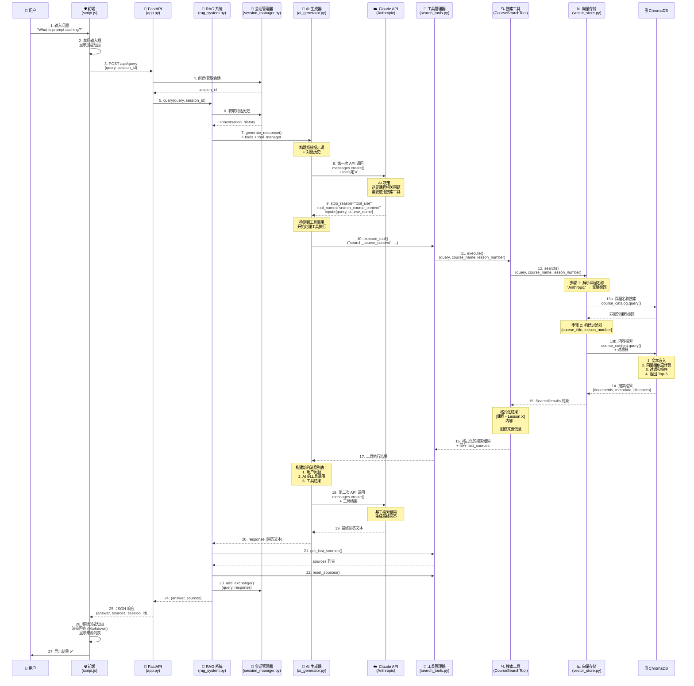
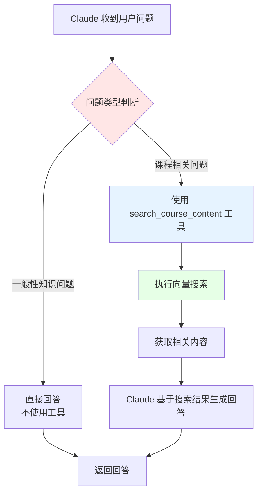
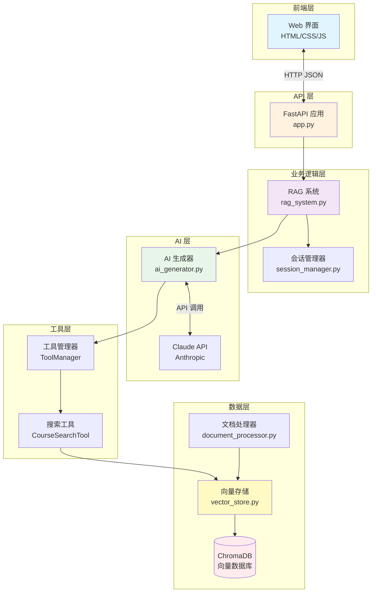
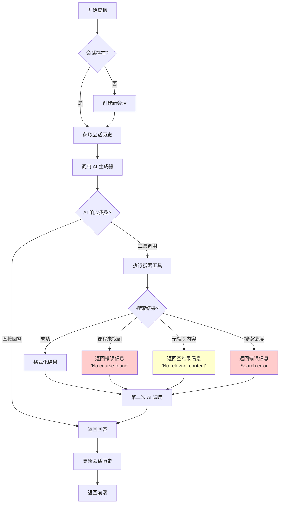

# RAG 系统查询处理流程图

## 完整流程图



## 数据流详解

### 📤 请求数据结构

**前端 → 后端：**
```json
{
  "query": "What is prompt caching?",
  "session_id": "abc123"  // 可选，首次为 null
}
```

**工具调用参数（Claude → 搜索工具）：**
```json
{
  "name": "search_course_content",
  "input": {
    "query": "prompt caching",
    "course_name": "Anthropic",
    "lesson_number": null
  }
}
```

**向量搜索结果（ChromaDB → 向量存储）：**
```json
{
  "documents": [
    "Course ... Lesson 5 content: Prompt caching retains...",
    "Course ... Lesson 5 content: This can be a large cost..."
  ],
  "metadata": [
    {"course_title": "Building Towards...", "lesson_number": 5, "chunk_index": 42},
    {"course_title": "Building Towards...", "lesson_number": 5, "chunk_index": 43}
  ],
  "distances": [0.23, 0.31]
}
```

### 📥 响应数据结构

**后端 → 前端：**
```json
{
  "answer": "Prompt caching is a feature that retains some of the results...",
  "sources": [
    "Building Towards Computer Use with Anthropic - Lesson 5"
  ],
  "session_id": "abc123"
}
```

## 关键决策点

### 🤔 AI 决策：是否使用工具？



### 🔍 向量搜索流程

```mermaid
flowchart LR
    A[查询文本<br/>'prompt caching'] --> B[文本嵌入<br/>SentenceTransformer]
    B --> C[查询向量<br/>[0.12, -0.45, ...]]
    C --> D[相似度计算<br/>余弦相似度]
    D --> E[应用过滤器<br/>course_title, lesson_number]
    E --> F[排序<br/>按相似度]
    F --> G[返回 Top-5<br/>最相关文档块]

    style C fill:#ffe6e6
    style D fill:#e6f3ff
    style G fill:#e6ffe6
```

## 组件交互架构



## 时序关系

### ⏱️ 两阶段 AI 调用

```mermaid
gantt
    title AI 生成器处理时序
    dateFormat X
    axisFormat %s

    section 第一阶段
    构建系统提示词 :a1, 0, 1
    第一次 Claude API 调用 :a2, 1, 3
    AI 决策（工具调用） :a3, 4, 1

    section 工具执行
    执行搜索工具 :b1, 5, 2
    向量搜索 :b2, 7, 3
    格式化结果 :b3, 10, 1

    section 第二阶段
    构建工具结果消息 :c1, 11, 1
    第二次 Claude API 调用 :c2, 12, 3
    生成最终回答 :c3, 15, 1
```



## 错误处理流程



## 性能优化点

### 🚀 优化策略

1. **工具调用优化**
   - AI 自主决定是否搜索（避免不必要的向量搜索）
   - 每次查询最多一次搜索

2. **向量搜索优化**
   - 限制返回结果数量（Top-5）
   - 使用过滤器减少搜索空间
   - ChromaDB 持久化存储

3. **会话管理优化**
   - 限制历史记录长度（最多 2 轮）
   - 避免上下文过长导致的成本增加

4. **API 调用优化**
   - 预构建系统提示词（静态常量）
   - 预构建基础 API 参数
   - Temperature=0（确定性输出）

## 总结

这个流程图展示了一个完整的 RAG 系统如何：
- ✅ 接收用户查询
- ✅ 智能决策是否需要搜索
- ✅ 执行语义向量搜索
- ✅ 基于检索结果生成回答
- ✅ 跟踪来源信息
- ✅ 维护对话上下文

核心特点是**两阶段 AI 调用 + 工具调用模式**，让 AI 自主决定何时需要检索外部知识。